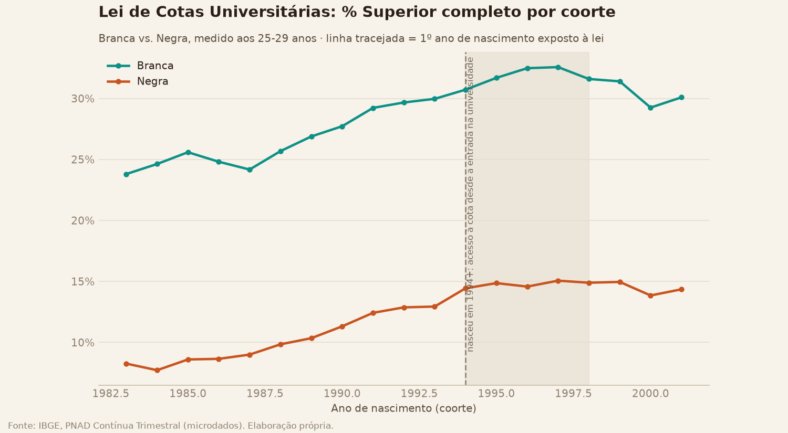
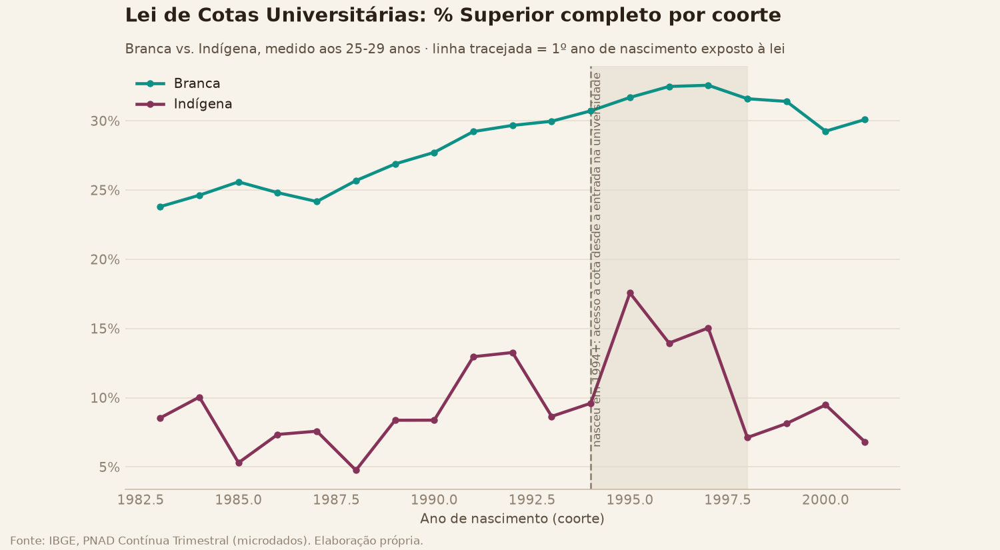
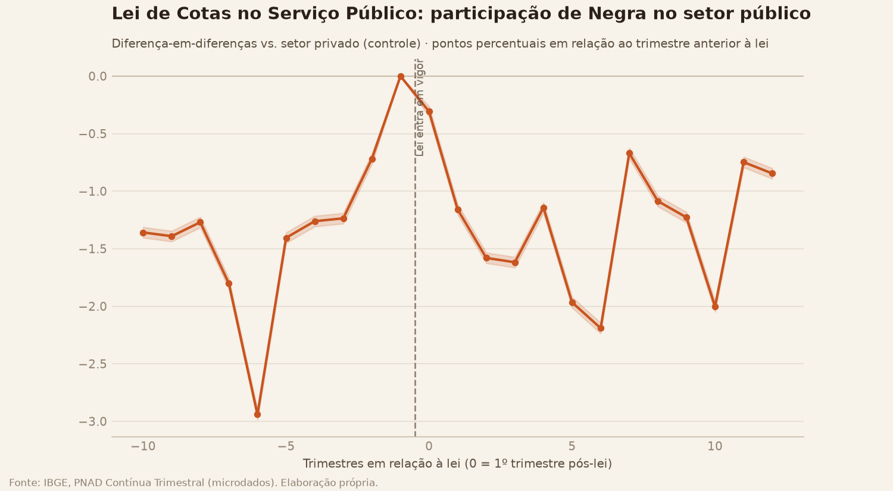
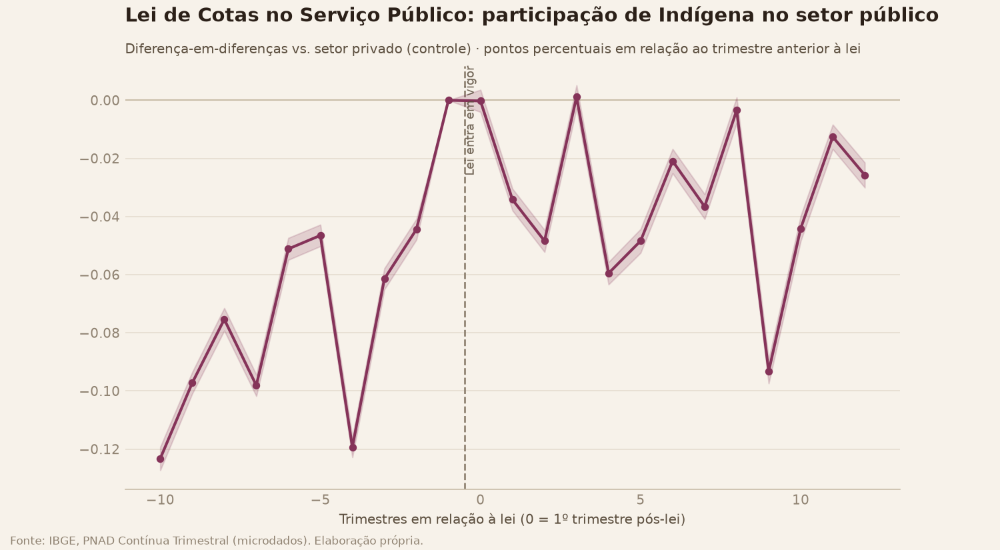
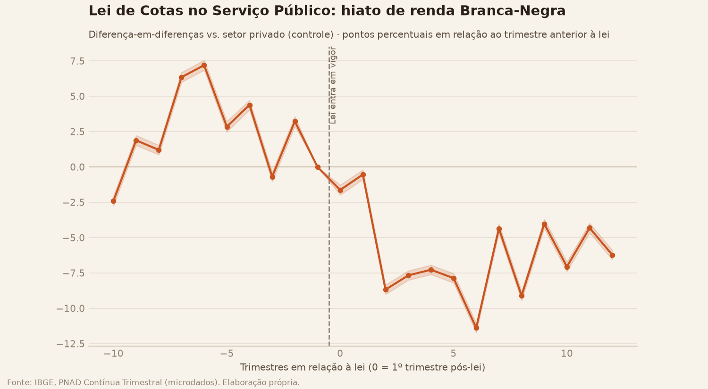

# Análise Causal — Leis de Cotas como Fonte de Variação Exógena

Primeira tentativa de identificação CAUSAL neste projeto — todo o resto do datahub (hiatos,
decomposições, Gini/Theil, segregação) é descritivo/correlacional, mesmo quando o método é
estatisticamente rigoroso. Este documento é um desenho PRELIMINAR: onde a identificação é
forte, digo; onde é fraca, digo também, no mesmo nível de destaque. Nenhum número aqui deve
ser lido como "prova de efeito causal" — ver a seção final, "o que isso NÃO prova".

## 0. Enquadramento

A PNAD Contínua não tem nota de vestibular nem identifica a instituição de ensino da pessoa
— o desenho de regressão descontínua (RDD) que a literatura padrão usa pra medir o efeito
causal das cotas raciais no Brasil (Mello 2022; Francis-Tan & Tannuri-Pianto) comparando
quem passou e quem não passou pela nota de corte da cota **não é possível com este dado**.

O desenho possível aqui é diferente: **diff-in-diff por COORTE DE EXPOSIÇÃO**, no nível
agregado (coorte de nascimento, ou setor×trimestre), não indivíduo tratado/não-tratado.
Isso troca identificação fina (o RDD compara pessoas quase idênticas de cada lado exato de
uma nota de corte) por cobertura nacional e histórica (RDD fica restrito às universidades e
anos com dado de vestibular disponível; aqui é o país inteiro, 2012-2026). É uma troca
honesta, não uma tentativa de imitar o RDD com dado pior — ver a seção 3.

Dois desenhos, duas leis:

- **Desenho A** — Lei de Cotas Universitárias (12.711/2012): coorte de nascimento como
  fonte de variação — quem nasceu antes ou depois de 1994 (18 anos antes da lei) teve
  acesso à cota, ou não, contando desde a entrada na universidade.
- **Desenho B** — Lei de Cotas no Serviço Público Federal (12.990/2014): event-study
  diff-in-diff, setor público vs. privado (controle), em torno de jun/2014.

## 1. Desenho A — Lei de Cotas Universitárias (12.711/2012)

### Método

`ano_exposicao = ano_nascimento_aprox + 18` (idade típica de entrada na universidade);
`exposto = 1` se `ano_exposicao >= 2012`, ou seja, quem nasceu em 1994 ou depois. É uma
aproximação de *intent-to-treat*: nem todo mundo entra na universidade aos 18 (erro de
medida que dilui qualquer efeito real, não infla), e a lei teve **rampa** de implementação
(universidades tinham até 2016 pra atingir 100% da cota) — por isso rodo duas
especificações: nível (dummy pós-1994) e rampa (anos desde o limiar, capado em 4).

Outcome: % com Superior completo, medido **sempre aos 25-29 anos** — idade fixa, pra não
confundir efeito da lei com "coorte mais nova ainda não teve tempo de terminar a
faculdade" (sem isso, qualquer comparação entre coortes seria uma comparação de
MATURAÇÃO, não de acesso à cota). Coortes disponíveis nessa janela de idade: nascidos
entre 1983 e 2001 (19 pontos de coorte, ~9-11 de cada lado do limiar de 1994).

### Resultado: nenhum efeito de nível detectado, tendências paralelas sustentadas

| Raça tratada | Tendência pré-1994 (coef, p) | DiD nível 2012 (coef, p) | DiD rampa (coef, p) |
|---|---|---|---|
| Negra | -0,08 pp/ano, p=0,42 | -0,04 pp, p=0,97 | ver parquet |
| Indígena | -0,14 pp/ano, p=0,86 | +1,81 pp, p=0,80 | ver parquet |

**Tendências paralelas: sustentadas nos dois pares** (coeficiente de tendência
raça-específica pré-1994 não significativo, p=0,42 e p=0,86) — pré-requisito do desenho
não é violado, o que é um sinal de validade metodológica, mesmo sem um efeito
significativo pra reportar.

**DiD nível: nenhum efeito estatisticamente significativo** em nenhum dos dois pares
(p=0,97 e p=0,80) — a rampa (capando em 4 anos) também não muda essa leitura
(`did_cotas_universitarias.parquet`).

### Placebo: nenhum "efeito" espúrio em datas falsas

Rodei a mesma especificação fingindo que a lei foi em 2008 e em 2016 (nenhuma mudança de
política real nessas datas). Nenhum dos quatro placebos (2 datas × 2 pares) deu
significativo — reforça que a ausência de efeito no corte real não é um artefato de uma
tendência espúria genérica que apareceria em qualquer data (se aparecesse nos placebos
também, seria motivo pra desconfiar até do resultado nulo).

Visualmente, as duas curvas (Branca e Negra) sobem de forma suave e contínua atravessando o
limiar de 1994 sem nenhum "degrau" visível — consistente com o DiD nulo. Isso é uma leitura
honesta possível: com um desenho de coorte agregado (só ~19 pontos de coorte, sem
identificar quem de fato usou a cota), um efeito real mas moderado pode não ter poder
estatístico suficiente pra aparecer — "não detectamos efeito" não é o mesmo que "não há
efeito", e a seção 3 volta nisso.

### Extensão de mecanismo (correlacional, não um resultado causal novo)

Pergunta: dentro do universo de coortes 1983-2001 já ocupadas hoje, o hiato de renda
Branca-Negra, controlando por idade/escolaridade/ocupação (Oaxaca-Blinder, mesmo método
de `gerar_decomposicao_oaxaca_blinder`), é diferente entre quem nasceu antes ou depois de
1994?

| Coorte | n | % explicada | Resíduo (log-pontos, p) | Resíduo aprox. em % |
|---|---:|---:|---|---:|
| Pré-exposição (< 1994) | 3.239.921 | 52,0% | 0,199 (p≈0) | ~22,0% |
| Pós-exposição (1994+) | 1.501.352 | 40,7% | 0,172 (p≈0) | ~18,8% |

O resíduo (o que sobra do hiato mesmo controlando por escolaridade/ocupação/idade) é um
pouco MENOR na coorte pós-exposição (~18,8% vs. ~22,0%), mas a % do hiato bruto EXPLICADA
por essas características cai (40,7% vs. 52,0%). **Leitura correlacional, três motivos
pra não superinterpretar**: (1) as coortes pós-1994 ainda estão em início/meio de carreira
(mesmo controlando por faixa etária, a composição etária dentro de cada faixa pode diferir);
(2) não sei quem de fato passou pela cota — é a mesma aproximação de exposição do Desenho A,
sem o teste formal de DiD aplicado aqui; (3) é uma correlação dentro do universo de quem já
está ocupado, sujeita a qualquer viés de seleção do próprio mercado de trabalho.

## 2. Desenho B — Lei de Cotas no Serviço Público Federal (12.990/2014)

### Método

Event-study: pessoa × setor_trabalho (Público/Privado) × trimestre relativo à lei (0 = 1º
trimestre pós-lei, 2014 T3 — a lei foi sancionada em jun/2014, 2014 T2; um trimestre de
defasagem administrativa pra concursos já em andamento não serem afetados
imediatamente). Privado é o grupo de CONTROLE (setor não atingido pela lei). Janela: -10 a
+12 trimestres (todo o período pré disponível; pós capado em 3 anos pra manter o gráfico
legível).

Dois outcomes: (a) participação de Negra/Preta/Parda/Indígena entre ocupados do setor
público (outcome pessoa a pessoa: `1 se raça==alvo`, em pontos percentuais); (b) hiato de
renda Branca-Negra especificamente DENTRO de cada setor.

Inferência: a CURVA (coeficiente por trimestre relativo) é calculada em forma fechada —
diferença de médias ponderadas com erro padrão somado em quadratura — porque uma regressão
totalmente saturada (uma dummy por trimestre × setor) rodada sobre dado já agregado por
célula tem grau de liberdade residual ZERO (bug real encontrado rodando pela primeira vez,
ver `docs/LIMITACOES_E_METODOLOGIA.md`). O RESUMO (um coeficiente só, tendência pré-lei e
DiD global) é uma regressão de verdade sobre o microdado, com erro-padrão clusterizado por
UPA — mesmo padrão de `pnadc_core.decomposicao_oaxaca_blinder`.

### Participação: nenhum efeito significativo, e a identificação FALHA pra Indígena

| Raça | Tendência pré-lei (pp/trim., p) | Tendências paralelas? | DiD (pp, p) |
|---|---|---|---|
| Negra | +0,124, p=0,08 | Sustentadas (limítrofe) | +0,075, p=0,82 |
| Indígena | +0,009, p=0,046 | **NÃO sustentadas** | +0,039, p=0,07 |
| Preta | +0,043, p=0,22 | Sustentadas | -0,060, p=0,72 |
| Parda | +0,081, p=0,23 | Sustentadas | +0,135, p=0,66 |

**Para Indígena, a identificação NÃO se sustenta** — a tendência pré-lei já era
significativamente diferente entre público e privado (p=0,046) antes da lei sequer existir.
Reportado como está: qualquer leitura do coeficiente de DiD pra Indígena nesse outcome não
é confiável, mesmo ele próprio não sendo significativo (p=0,07). Pra Negra, a tendência
pré-lei fica BEM perto do limiar de significância (p=0,08) — não reprovo o desenho pelo
critério formal (p ≥ 0,05), mas é uma tendência pré-existente forte o bastante pra tratar o
resultado nulo de Negra com o mesmo grau de cautela. Preta e Parda sustentam tendências
paralelas com folga, e também não têm DiD significativo. **Conclusão honesta: este desenho
não detecta mudança na COMPOSIÇÃO racial do setor público atribuível à lei**, dentro da
janela de ~3 anos observada.

### Hiato de renda: efeito significativo, tendências paralelas sustentadas

Diferente da participação, aqui a tendência pré-lei NÃO diverge (coef=-0,001 log-pontos por
trimestre, p=0,61) — tendências paralelas sustentadas com folga. O DiD global (interação
tripla tempo × setor × raça, em log-renda) dá **+0,020 log-pontos (~2,0%), p=0,041** —
estatisticamente significativo a 5%.

Direção: o hiato de renda Branca-Negra especificamente DENTRO do setor público **encolheu
mais** do que no setor privado, depois da lei — visível também na curva ponto a ponto, que
vira de um padrão ruidoso positivo/misto pré-lei pra um padrão consistentemente negativo
pós-lei.

**Esse é o resultado mais bem-identificado de toda a análise** — tendências paralelas
sustentadas, efeito significativo, magnitude modesta mas não trivial (~2% em log-renda,
equivalente a uma fração de ponto percentual do hiato total do setor). Ainda assim, três
ressalvas:

1. **Limitação de esfera de governo, documentada sem rodeio**: `setor_trabalho` não
   distingue federal de estadual/municipal — só o federal foi atingido pela Lei
   12.990/2014. A categoria "Público" aqui MISTURA federal (tratado) com estadual/municipal
   (nunca tratados) — o efeito estimado é necessariamente DILUÍDO por conter observações
   nunca tratadas dentro do próprio grupo "tratado". Um efeito significativo mesmo diluído é
   um sinal de que o efeito real (isolado ao federal) provavelmente é maior — mas não dá pra
   quantificar quanto maior com este dado. Não existe uma variável já extraída que separe
   esfera de governo (`setor_atividade`/VD4010 tem uma categoria de administração pública,
   mas também não separa por esfera) — registrado como limitação, não uma solução forçada.
2. **Um resultado significativo entre vários testes**: sem correção formal de múltiplas
   comparações (mesma limitação já documentada pro resto do projeto) — um p=0,041 isolado
   entre ~6 testes desta rodada merece mais cautela do que um p muito menor teria.
3. **A curva pré-lei é ruidosa ponto a ponto**, mesmo com a tendência LINEAR não
   significativa — oscila entre -2,4 e +7,2 pp antes da lei. "Tendência linear não
   significativa" não é o mesmo que "série plana" — é uma leitura mais fraca de tendências
   paralelas do que se a série pré-lei fosse visualmente estável.

## 3. Heterogeneidade geográfica

O resultado nacional dos dois desenhos é majoritariamente nulo. Esta seção testa se esse
nulo é uniforme pelo país, quebrando por Região, área urbana/rural, e (só pro Desenho B)
Distrito Federal vs. resto do Brasil. Amostra checada antes de rodar: Negra fecha
`n_minimo` em toda região/área/DF nos dois desenhos; Indígena só fecha em Norte (vs. Resto
do Brasil, não as 5 regiões) e em área Urbana (Rural fica de fora, célula mais fina com
n=25, abaixo do mínimo de 30) — ver `docs/LIMITACOES_E_METODOLOGIA.md`.

### Desenho A por região/área

`did_cotas_universitarias_heterogeneidade.parquet`. A maioria dos recortes repete o nulo
nacional (nenhum DiD significativo em nenhuma região/área/raça), mas dois deles **falham
o teste de tendências paralelas** — a identificação não se sustenta nesses dois pontos
específicos, mesmo o nacional estando ok:

- **Negra, Região Norte**: tendência pré-2012 coef=-0,39 pp/ano, **p=0,025**.
- **Negra, área Rural**: tendência pré-2012 coef=-0,36 pp/ano, **p=0,000004** — falha bem
  mais forte que a do Norte.

Indígena (Norte vs. Resto do Brasil, e área Urbana) tem tendências paralelas sustentadas
nos três recortes, mas os DiDs são extremamente ruidosos (coeficientes de -5,7 a +5,3 pp,
todos não significativos) — esperado dado o tamanho de amostra, não uma novidade.

### Desenho B por região/área/DF

`did_cotas_servico_publico_heterogeneidade.parquet` +
`..._heterogeneidade_curvas.parquet`. Dois achados que pedem destaque:

- **Falhas de tendências paralelas na participação**: Negra no Nordeste (p=0,012), Parda
  no Nordeste (p=0,009) e Parda no Sul (p=0,004) — identificação não se sustenta nesses
  três pontos. O hiato de renda no Norte também falha (p=0,049, no limite). Todo o resto
  (Centro-Oeste, Sudeste, as duas áreas, Indígena Norte/Resto, DF/Resto) sustenta
  tendências paralelas.
- **Centro-Oeste tem o efeito mais forte e mais bem-identificado de toda a análise**: o
  hiato de renda encolhe **+5,6% (log-pontos), p=0,030**, com tendências paralelas
  sustentadas com folga (p=0,30) — maior e mais significativo que o próprio resultado
  nacional (+2,0%, p=0,041).
- **A hipótese do Distrito Federal NÃO se confirmou**. A ideia era usar o DF como
  aproximação parcial de "federal puro" (funcionalismo federal concentrado lá), esperando
  um efeito mais forte que a média nacional — o resultado saiu **praticamente zero**
  (hiato de renda: coef=-0,006, p=0,89; participação: p=0,26). Como o DF está DENTRO do
  Centro-Oeste, isso é um resultado genuinamente contraintuitivo: o efeito significativo do
  Centro-Oeste parece vir dos OUTROS três estados da região (Goiás, Mato Grosso, Mato
  Grosso do Sul), não do DF especificamente. Duas leituras possíveis, nenhuma confirmável
  com este dado: (a) o efeito da lei não está de fato concentrado onde o funcionalismo é
  mais federal, o que enfraqueceria a leitura "federal" do resultado nacional; ou (b) o
  mercado de trabalho do DF é atípico o bastante (salários e composição muito diferentes da
  média) pra não seguir o padrão regional mesmo se o mecanismo for real. **Não resolve a
  limitação de esfera de governo — se algo, complica a história simples** de que o efeito é
  "federal, só diluído".

## 4. Comparação com a literatura

O RDD usado por Mello (2022) e Francis-Tan & Tannuri-Pianto — comparando candidatos
aprovados por pouco pela cota com candidatos reprovados por pouco, dentro de uma
universidade e um ano específicos — é o desenho mais forte já publicado sobre cotas
raciais no Brasil, porque compara pessoas quase idênticas de cada lado de uma régua clara.
Este exercício não tenta competir com isso: é complementar. Ganha em representatividade
nacional e histórica (RDD fica restrito às universidades/anos com nota de corte disponível
publicamente; aqui é o país inteiro, todo o período 2012-2026). Perde em identificação
fina — o desenho por coorte agregada não sabe quem de fato passou pela cota, só quem
NASCEU numa janela que teve acesso a ela, e isso dilui qualquer efeito real na direção de
zero. Um resultado nulo aqui é compatível tanto com "não há efeito" quanto com "há efeito,
mas o desenho não tem poder pra detectá-lo" — a literatura de RDD é a referência pra
distinguir entre essas duas leituras, não este documento.

## O que isso NÃO prova

- **Não prova que a Lei de Cotas Universitárias não teve efeito educacional.** O desenho
  por coorte agregada tem baixo poder estatístico (19 pontos de coorte) e não identifica
  quem de fato usou a cota — um efeito real pode existir e não aparecer aqui.
- **Não prova que a Lei de Cotas no Serviço Público não mudou a composição racial do
  funcionalismo.** A janela observada (~3 anos pós-lei) pode ser curta demais pra uma
  mudança de composição que depende de rotatividade lenta (concursos, aposentadorias);
  o resultado nulo é sobre ESTA janela, não uma afirmação geral.
- **O efeito significativo no hiato de renda do setor público NÃO é uma estimativa do
  efeito da Lei 12.990/2014 isoladamente** — está diluído por misturar esfera federal
  (tratada) com estadual/municipal (não-tratada), e é um resultado isolado sem correção de
  múltiplas comparações.
- **Nenhum dos dois desenhos identifica o MECANISMO** pelo qual um efeito (quando
  detectado) ocorre — a extensão de mecanismo do Desenho A é correlacional, explicitamente.
- **Nada aqui substitui o RDD da literatura** como estimativa de referência do efeito
  causal das cotas universitárias — ver seção 4.
- **"Tendências paralelas sustentadas" é uma leitura de PODER ESTATÍSTICO insuficiente
  pra REJEITAR a suposição, não uma prova de que a suposição é verdadeira** — com poucos
  pontos de coorte/trimestre, um teste pouco potente pode simplesmente não conseguir
  detectar uma divergência real que existe.
- **O resultado nulo do teste do Distrito Federal (seção 3) NÃO refuta a hipótese
  "federal" do resultado nacional** — é um teste de baixo poder (amostra de Indígena no DF
  é praticamente inexistente; mesmo pra Negra, o DF sozinho é uma fração pequena da
  amostra nacional) e um resultado atípico de UMA unidade geográfica específica. Ele
  complica a leitura simples, mas não decide a questão num sentido ou no outro.
