# Análise Fase 1 — PNAD Contínua (2012-2026)

Galeria completa dos gráficos exploratórios da Fase 1 — todas as interseções entre raça,
gênero, faixa etária e escolaridade, para renda habitual real (deflator oficial do IBGE, ver
[PLANO.md](PLANO.md)), Brasil, salvo indicação contrária. Gerados por
`src/processing/graficos_fase1.py` a partir dos datasets em `data/processed/*.parquet`.
Também disponível como apresentação: [Datahub_Racial_Brasil_Fase1.pptx](Datahub_Racial_Brasil_Fase1.pptx).

119 gráficos ao todo (a apresentação em PPTX também abre com uma seção "Renda média" de 48
subseções — 12 combinações de dimensões × Todas as raças/Apenas negros × Valores/Hiato, com
teste de Welch nas 24 combinações de hiato — que reaproveita gráficos já listados nas seções
temáticas abaixo, sem galeria separada aqui). Índice:

- [Raça](#raça)
- [Hiato Branca vs. Negra — série histórica](#hiato-branca-vs-negra--série-histórica)
- [É ocupação, ou é cor da pele?](#é-ocupação-ou-é-cor-da-pele)
- [Raça cruzada com tudo: as combinações que faltavam](#raça-cruzada-com-tudo-as-combinações-que-faltavam)
- [Aprofundamentos: região, segregação e quebras estruturais](#aprofundamentos-região-segregação-e-quebras-estruturais)
- [Aprofundamentos: novas variáveis da PNAD](#aprofundamentos-novas-variáveis-da-pnad)
- [Geração: seguindo a mesma coorte, não a mesma faixa etária](#geração-seguindo-a-mesma-coorte-não-a-mesma-faixa-etária)
- [Quem está no topo 10%? Negra vs. Branca](#quem-está-no-topo-10-negra-vs-branca)
- [Decomposição dos 4 quartis de renda — Negra vs. Branca](#decomposição-dos-4-quartis-de-renda--negra-vs-branca)
- [Desigualdade interna, setor público/privado e sobre-qualificação](#desigualdade-interna-setor-públicoprivado-e-sobre-qualificação)
- [A função quantil da renda, em R$, e sua inversa](#a-função-quantil-da-renda-em-r-e-sua-inversa)
- [Raça × Gênero](#raça--gênero)
- [Preta × Parda × Gênero](#preta--parda--gênero)
- [Raça × Faixa etária](#raça--faixa-etária)
- [Preta × Parda × Faixa etária](#preta--parda--faixa-etária)
- [Raça × Escolaridade](#raça--escolaridade)
- [Preta × Parda × Escolaridade](#preta--parda--escolaridade)
- [Raça × Gênero × Escolaridade](#raça--gênero--escolaridade)
- [Raça × Gênero × Faixa etária](#raça--gênero--faixa-etária)
- [Escolaridade × Raça × Gênero](#escolaridade--raça--gênero)
- [Raça × Gênero × Faixa etária × Escolaridade](#raça--gênero--faixa-etária--escolaridade)
- [Limitações a ter em mente](#limitações-a-ter-em-mente-lendo-estes-gráficos)

## Raça

Hiato grande e persistente entre Branca e Negra/Indígena ao longo de toda a série.

Preta e Parda **não são a mesma coisa** — mas andam muito próximas ao longo de toda a série,
com Parda ultrapassando levemente Preta nos últimos anos.

## Hiato Branca vs. Negra — série histórica

Com teste de significância estatística (Welch, IC 95%) calculado trimestre a trimestre a
partir dos microdados — ver `src/processing/agregacoes_pnadc.py::gerar_hiato_racial`.

O hiato relativo caiu de ~76% (2012) para ~66% (2026) — **todos os 58 trimestres da série são
estatisticamente significativos a 95%** (dado o tamanho da amostra, o intervalo de confiança
é muito estreito e praticamente invisível no gráfico).

Em R$, uma história diferente aparece: o hiato **disparou durante a pandemia** (pico de
~R$2.035 em 2020 T3) antes de despencar para o menor valor da série (~R$1.510 em 2021 T4) e
se recuperar até os ~R$1.912 atuais. O hiato percentual e o absoluto contam ângulos
complementares — vale olhar os dois.

## É ocupação, ou é cor da pele?

Pergunta: controlando por idade, escolaridade e ocupação, o hiato de renda negros vs.
brancos ainda existe, ou desaparece? Decompondo progressivamente (últimos 8 trimestres,
pessoas ocupadas, padronização direta — ver [PLANO.md](PLANO.md) para o método completo):

| Controle | Hiato |
|---|---|
| Nenhum (hiato bruto) | 67,0% |
| + faixa etária | 63,9% |
| + faixa etária + escolaridade | 30,3% |
| + faixa etária + escolaridade + ocupação | **24,3%** |

Idade sozinha quase não explica nada. Escolaridade explica mais da metade do hiato. Ocupação
explica uma fatia adicional — mas **mesmo comparando pessoas da mesma idade, mesma
escolaridade e mesma categoria ocupacional, sobra um hiato de ~24%** que essas três variáveis
não explicam. Não é prova direta de discriminação (outros fatores não medidos aqui — horas
trabalhadas, formalidade, região, senioridade dentro da ocupação — também podem contribuir),
mas mostra que "estar na mesma ocupação" está longe de eliminar o hiato racial de renda.

**E quanto ocupação SOZINHA explica, sem controlar idade/escolaridade primeiro?** A barra
"Só ocupação (isolado)" no mesmo gráfico responde: o hiato cai de 67% pra **33%** — ou seja,
ocupação por si só (uma única variável) já explica quase tanto quanto idade+escolaridade
JUNTAS (que levam a 30%). Ocupação é, isoladamente, um dos fatores mais explicativos do hiato
que temos nesta base.

**Mesma pergunta, com teste de significância formal** — regressão (Oaxaca-Blinder):

Com os mesmos controles, o resíduo (parte "não-explicada" — mesma idade, escolaridade e
ocupação, retorno diferente) converge pra **+22%**, muito perto dos 24% da padronização
direta acima — dois métodos diferentes concordando é uma checagem de robustez importante —
e agora **com teste de significância** (p < 0,001, não é ruído amostral).

O resíduo não é uniforme ao longo da distribuição de renda: menor na mediana (~15%), mas
maior tanto na base (P10, ~31% — "piso pegajoso") quanto no topo (P90, ~36% — "teto de
vidro", coerente com o hiato que se abre no Superior completo).

A mesma barra "só ocupação" aqui: explica **40% do hiato** de log-renda, com significância
formal (p < 0,001) — um pouco menos que os 53% que idade+escolaridade+ocupação juntas
explicam neste método, mas ainda assim substancial pra uma única variável.

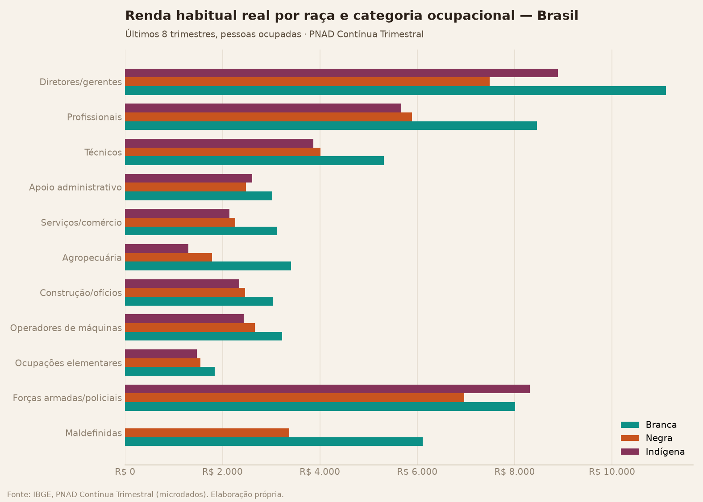

E olhando direto, sem decomposição nenhuma: dentro de **cada uma** das 11 categorias
ocupacionais, Branca ganha mais que Negra — o hiato não desaparece nem na categoria mais bem
paga (Diretores/gerentes: R\$11.107 Branca vs. R\$7.489 Negra) nem na pior paga (Ocupações
elementares: R\$1.844 vs. R\$1.545).

## Raça cruzada com tudo: as combinações que faltavam

Usuário perguntou se todas as combinações de raça × gênero × faixa etária × geração ×
escolaridade × ocupação tinham sido feitas — não, faltavam justamente as que envolviam
ocupação (nunca virou gráfico próprio) e algumas cruzando geração/faixa etária com
escolaridade/ocupação. Completado aqui — cada gráfico é um heatmap com um painel por raça
(Branca/Negra/Indígena), célula em branco = amostra insuficiente naquele cruzamento (mais
comum com Indígena, sample menor).

**Combinação deliberadamente pulada**: raça × faixa etária × geração. As duas são visões
diferentes da mesma coisa (idade) — faixa etária é a idade ATUAL da pessoa, geração é o ano
de nascimento. Cruzá-las criaria células minúsculas e instáveis sem agregar informação nova
além do que os gráficos "raça × faixa etária" e "raça × geração" (seções anteriores) já
mostram separadamente.

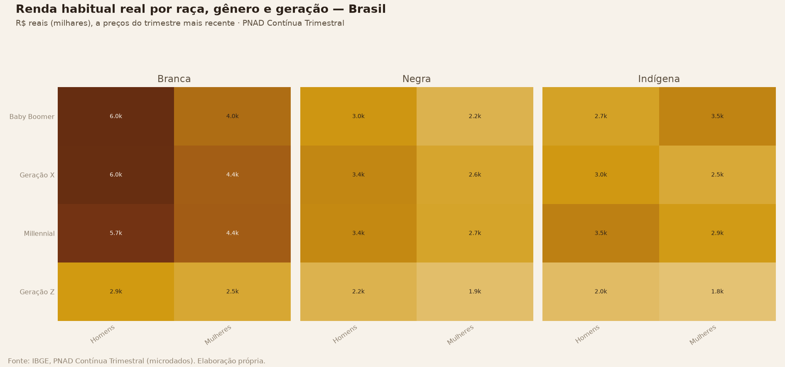
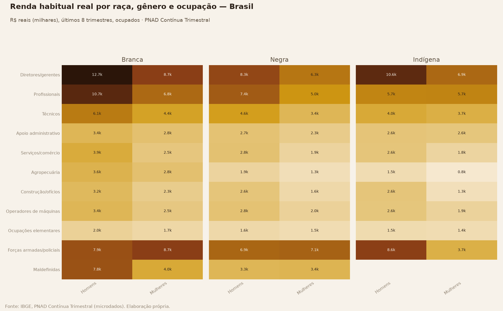
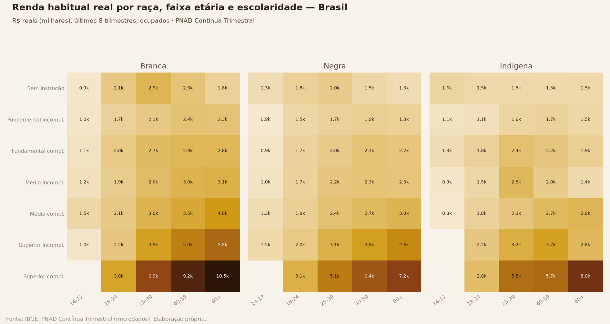
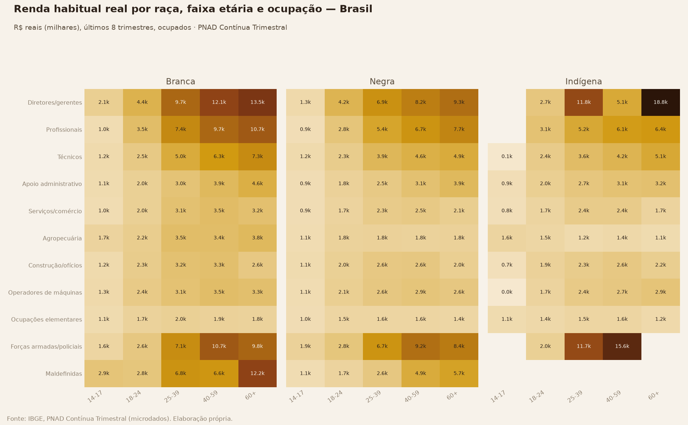
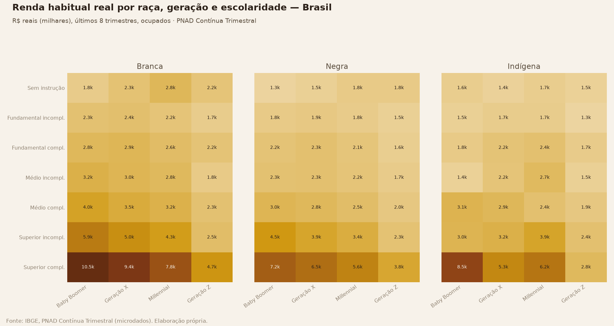
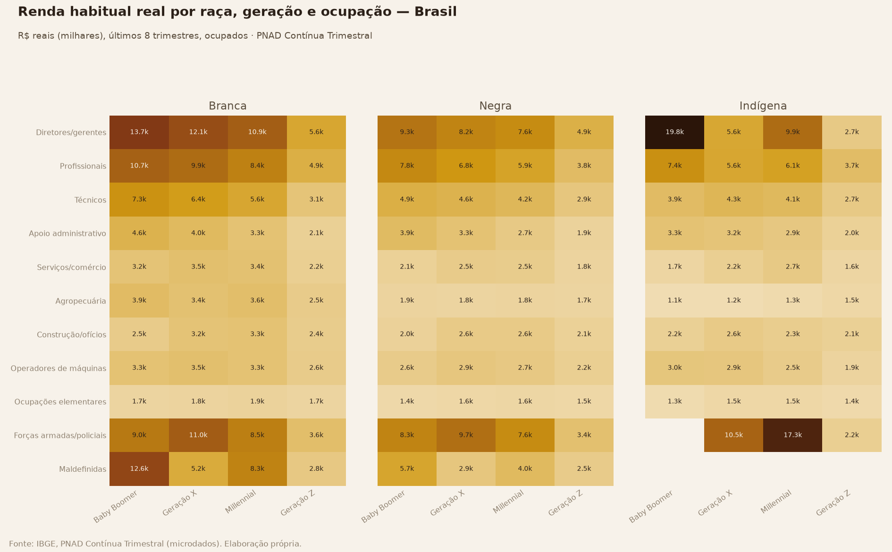
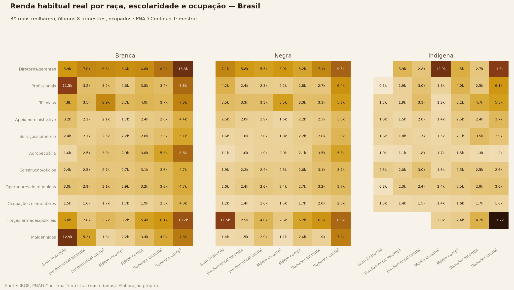

Padrão consistente em todos os sete: dentro de praticamente qualquer par de células
comparáveis (mesma faixa etária/geração/escolaridade E mesma ocupação), Branca aparece com
renda mais alta que Negra na grande maioria dos cruzamentos — o hiato resiste a controles
bem finos, não só aos controles agregados já vistos nas seções de decomposição.

## Aprofundamentos: região, segregação e quebras estruturais

O hiato racial varia MUITO entre regiões — Sudeste tem o maior (65-85% ao longo da série),
Sul o menor (45-55%). A desigualdade regional do Brasil também aparece especificamente no
hiato racial, não é uniforme pelo país.

Índice de dissimilaridade de Duncan: ~17% de um dos grupos (Branca ou Negra) precisaria
trocar de categoria ocupacional pra igualar a distribuição do outro — mede segregação
ocupacional em si, à parte do efeito dela na renda (já coberto pela decomposição acima).

Teste tipo Chow (simplificado) nos 3 eventos já mapeados como possíveis pontos de inflexão:
os 3 mostram mudança estatisticamente significativa de patamar e/ou inclinação — não é
prova de causalidade (a série tem só 58 pontos e outros eventos concorrentes, como a
pandemia perto da reforma da previdência, não são controlados), mas é evidência de
correlação temporal que vale documentar.

## Aprofundamentos: novas variáveis da PNAD

Quatro variáveis da PNAD ainda não exploradas nas rodadas anteriores — ver decodificação
completa em [LIMITACOES_E_METODOLOGIA.md](LIMITACOES_E_METODOLOGIA.md).

% com carteira assinada (entre empregados): Branca 72%, Negra 63%, Indígena 52% (2026 T2) —
o hiato de proteção social/formalização acompanha o hiato de renda.

Testando se o hiato de renda vem de jornada menor: **não vem** — a jornada semanal é
parecida entre os três grupos (38,8h Branca vs. 37,7h Negra vs. 36,7h Indígena, 2026 T2), e
o hiato na renda POR HORA (~65%) é quase idêntico ao hiato na renda mensal (67%). O hiato é
de remuneração por hora mesmo, não de quantas horas se trabalha.

Analfabetismo residual ainda é uma realidade nas cohorts mais velhas: 93% Branca vs. 80%
Negra vs. 72% Indígena alfabetizados entre 60+ anos (2026 T2).

Entre quem está fora da força de trabalho, Negra (7,4%) e Indígena (5,9%) desistem de
procurar emprego a taxas bem maiores que Branca (3,4%, 2026 T2) — desalento vai além da taxa
de desocupação simples e também tem recorte racial.

## Geração: seguindo a mesma coorte, não a mesma faixa etária

A PNAD Contínua é um corte transversal **repetido**, não um painel longitudinal — "pessoas
de 14-17 anos" em 2012 e em 2026 são pessoas **diferentes** chegando nessa idade, não as
mesmas envelhecendo. Um gráfico "por faixa etária" ao longo do tempo mistura coortes de
nascimento diferentes a cada trimestre. Geração resolve isso agrupando por ano de nascimento
aproximado (ano da pesquisa − idade) — cada linha abaixo é (aproximadamente) o MESMO grupo de
pessoas nascidas numa janela, observado envelhecendo dentro da janela 2012-2026 (método de
coorte sintética, Deaton 1985).

O hiato varia MUITO entre gerações — dos ~30% na Geração Z aos ~90-100% no Baby Boomer — e
o do Baby Boomer especificamente **cresce** ao longo da janela observada, provavelmente
porque quem continua trabalhando até os 60-80 anos não é uma amostra aleatória (efeito de
seleção: divergência racial em quem se aposenta/sai do mercado vs. quem permanece).

Snapshot do trimestre mais recente, cada geração na idade em que está hoje (não controla por
idade) — o hiato racial aparece em todas as quatro gerações com amostra suficiente.

## Quem está no topo 10%? Negra vs. Branca

Não é "top 10% do Brasil" (que seria quase todo Branca, dado o hiato) — é o topo 10% **DENTRO**
de cada raça, com o limiar (P90) calculado separadamente para Branca e para Negra. Responde:
quem chega ao topo dentro do próprio grupo racial, e como isso mudou ao longo do tempo?
(Indígena fica de fora — amostra insuficiente pra um P90 confiável por trimestre.)

% de mulheres no topo 10% de cada raça: Branca sempre um pouco à frente da Negra, mas a
distância vem encolhendo ao longo da série.

O achado mais forte desta seção: o topo 10% dos negros ficou muito mais escolarizado — de
38% com Superior completo em 2012 para ~58% hoje — mas ainda fica atrás do topo dos brancos
(~83%). A escolaridade de quem chega ao topo está convergindo, ainda que o nível continue
bem diferente.

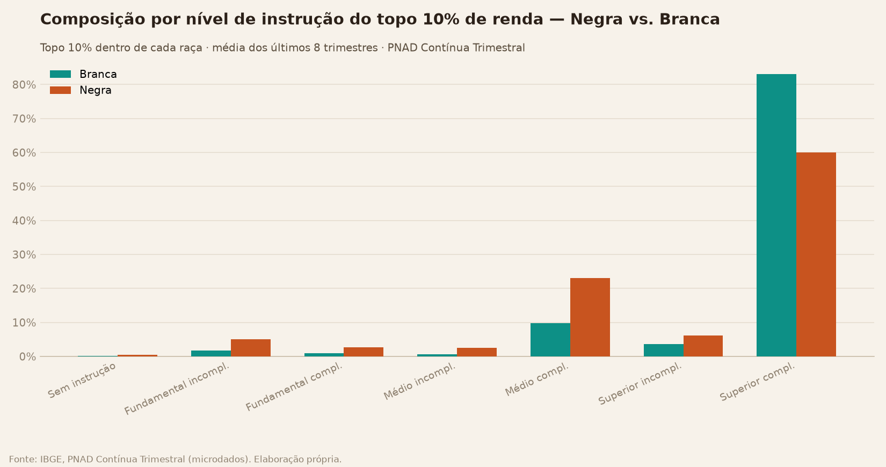

A distribuição completa pelos 7 níveis (não só Superior completo): o topo 10% dos negros tem
mais que o dobro de Médio completo (23%) do que o dos brancos (10%) — quem não chega ao
Superior completo dentro do topo dos negros, na maioria das vezes, já concluiu o Médio, não
fica pra trás no Fundamental.

Composição por faixa etária do topo 10%, média dos últimos 8 trimestres — o topo dos negros é
um pouco mais concentrado em 25-39 anos e um pouco menos em 60+ do que o topo dos brancos.

Composição por geração do topo 10% — o topo dos negros pende um pouco mais para
Millennial/Geração Z; o topo dos brancos, para Baby Boomer/Geração X. Coerente com o gráfico
de escolaridade acima: gerações mais novas de negros parecem estar chegando ao topo com
credenciais mais parecidas às dos brancos do que gerações mais velhas.

## Decomposição dos 4 quartis de renda — Negra vs. Branca

O topo 10% acima é um recorte estreito (P90). Aqui vai a versão completa: **os 4 quartis**
da distribuição de renda (Q1 = 25% que menos ganham, ..., Q4 = 25% que mais ganham),
calculados DENTRO de cada raça — permite comparar a composição demográfica de QUALQUER fatia
da distribuição entre Negra e Branca, não só o topo.

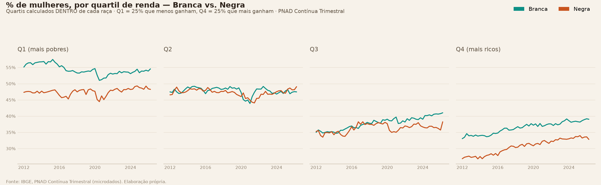

% de mulheres em cada quartil: maioria entre as mais pobres (Q1) nas duas raças, minoria
entre as mais ricas (Q4) — e a distância ENTRE as raças também cresce no Q4 (39% Branca vs.
33% Negra), não só a diferença entre quartis dentro de cada raça.

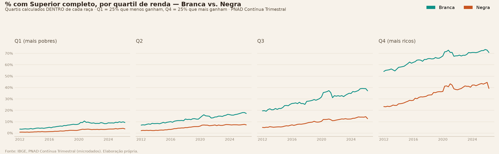

O achado mais forte desta seção: % com Superior completo cresce em todos os quartis nas duas
raças, mas o hiato racial se ABRE dramaticamente no topo — no Q4, ~72% de Branca tem Superior
completo contra ~40% de Negra (uma diferença de 32 p.p.); no Q1, a diferença é de só ~6 p.p.
Confirma, com o painel completo, o padrão já visto no gráfico de topo 10%: quanto mais alto
na distribuição de renda, maior o hiato educacional entre as raças.

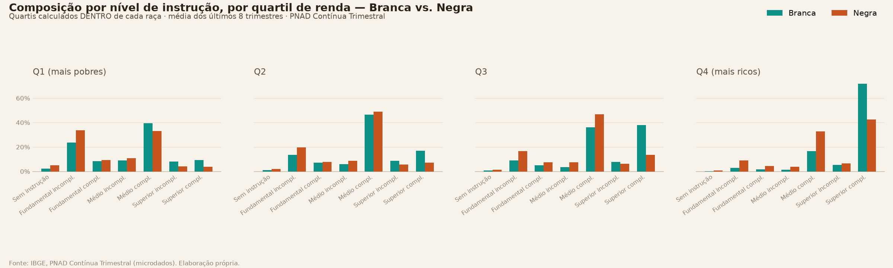

Distribuição completa pelos 7 níveis, um painel por quartil — mesmo padrão do topo 10% (Médio
completo mais presente entre os negros, Superior completo mais presente entre os brancos)
visível em todas as fatias da distribuição, não só no topo.

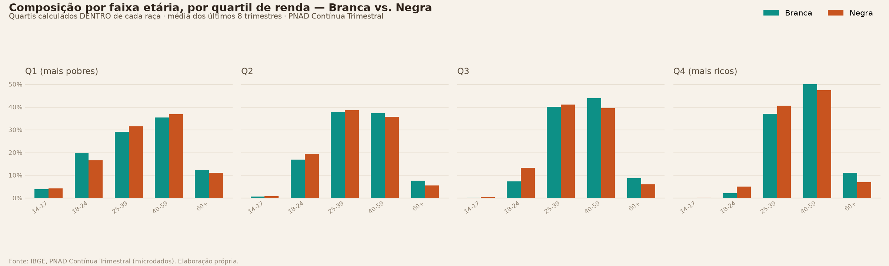

Composição por faixa etária, um painel por quartil — perfil etário bem parecido entre Negra e
Branca dentro de cada quartil (diferente da escolaridade, que diverge fortemente no topo).

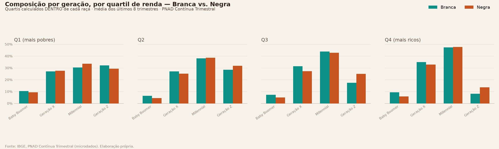

Composição por geração, um painel por quartil — mesmo padrão qualitativo do topo 10%, agora
visível em todas as fatias da distribuição.

## Desigualdade interna, setor público/privado e sobre-qualificação

Cinco análises sugeridas e validadas com o usuário (via menu de opções) antes de implementar
— ver [PLANO.md](PLANO.md) pra lista completa das ideias apresentadas e as que ficaram pra
depois.

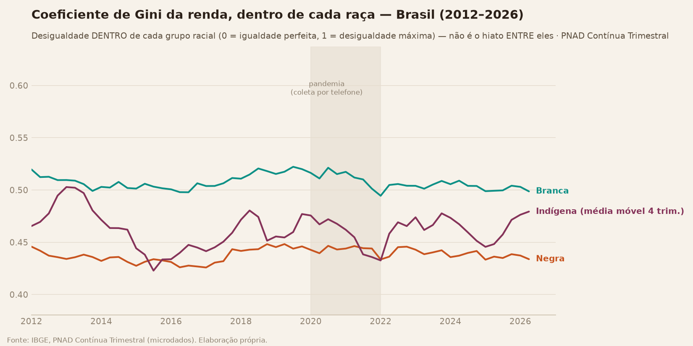

Coeficiente de Gini calculado DENTRO de cada raça — pergunta diferente do hiato ENTRE elas.
Achado que exige leitura cuidadosa: Branca tem Gini mais alto (mais desigualdade interna) que
Negra. Isso não significa que a população negra está "melhor" — só que sua distribuição de
renda é mais comprimida perto da base (menos gente muito rica para abrir a distribuição).

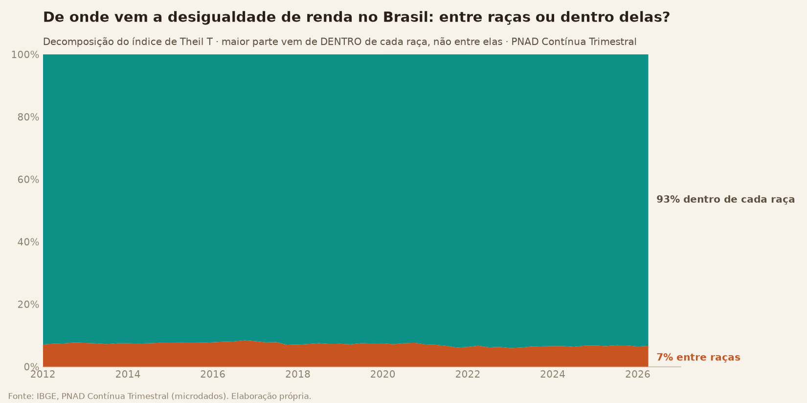

Só ~7% da desigualdade TOTAL de renda no Brasil vem de diferença ENTRE raças — os outros 93%
são desigualdade DENTRO de cada raça. Isso não diminui o hiato racial (que continua grande e
significativo, ver seções anteriores) — mostra que a desigualdade brasileira tem várias
fontes, e raça é uma delas identificável, não a maior fatia isolada.

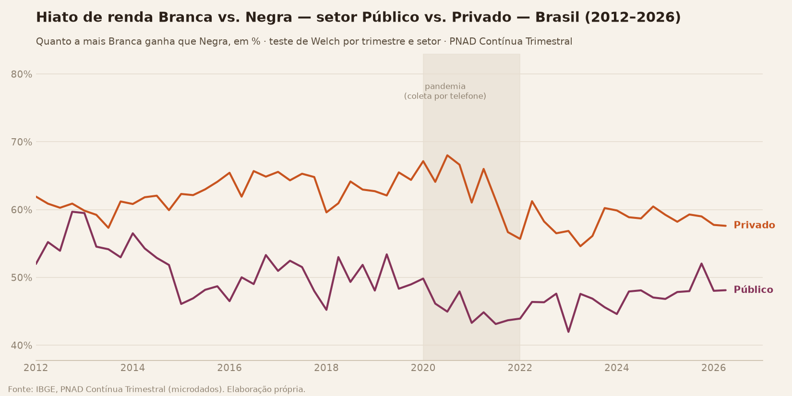

Confirma uma hipótese conhecida da literatura: o hiato racial é sistematicamente menor no
setor Público (~45-50%, salário de concurso segue tabela padronizada) do que no Privado
(~58-68%, mais espaço pra negociação individual e discricionariedade).

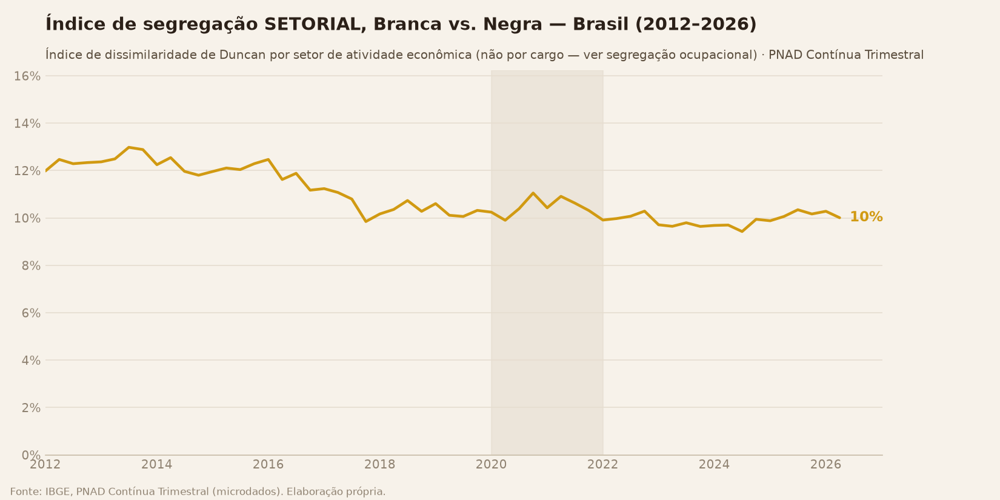

Segregação por SETOR econômico (~10%) é menor que por OCUPAÇÃO/cargo (~17%, ver seção
anterior) — Branca e Negra se distribuem de forma mais parecida entre setores da economia do
que entre cargos específicos dentro desses setores.

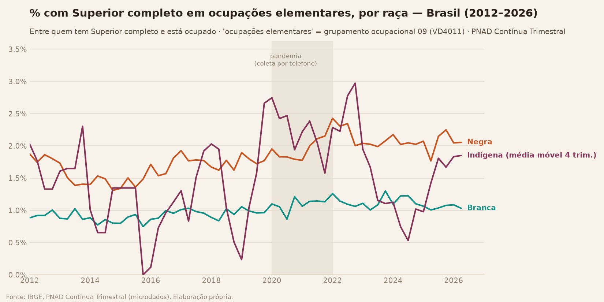

Entre quem tem Superior completo, a taxa de "sobre-qualificação" (acabar numa ocupação
elementar, o proxy padrão de mismatch credencial-ocupação na literatura) é quase o DOBRO para
Negra em relação a Branca ao longo de quase toda a série — mesmo diploma, resultado
profissional diferente. Indígena tem amostra pequena aqui (poucas pessoas com Superior
completo) e a série fica bem ruidosa mesmo suavizada — ler com cautela.

## A função quantil da renda, em R$, e sua inversa

Os gráficos de quartil (seção acima) mostram QUEM está em cada fatia da distribuição —
composição por gênero/idade/geração/escolaridade. Aqui vai o complemento pedido: os valores
em R$ de fato, nas duas direções.

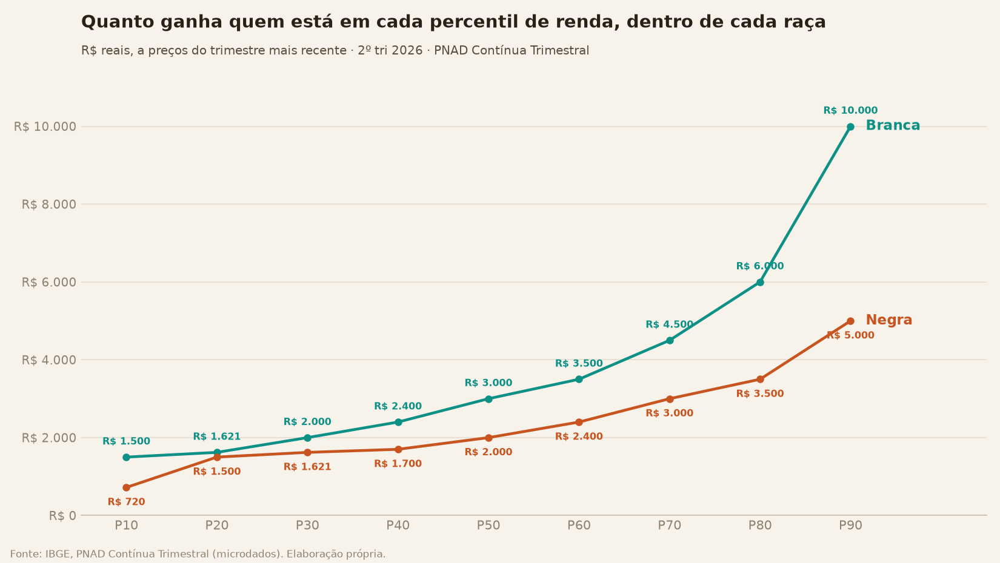

Responde diretamente: "os 10% mais pobres entre os negros ganham quanto, comparado aos 10%
mais pobres entre os brancos? E os 20%? E assim por diante?" No P10, Branca ganha R$1.500 e
Negra R$720 — mais que o dobro. Na mediana (P50), R$3.000 vs. R$2.000. No P90, R$10.000 vs.
R$5.000 — o hiato em R$ cresce conforme sobe a distribuição.

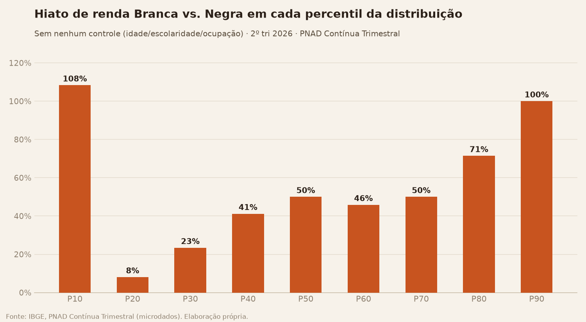

O hiato bruto (sem nenhum controle, diferente da versão residual da seção "É ocupação, ou é
cor da pele?") não é uniforme ao longo da distribuição: maior na base (108% no P10) e no topo
(100% no P90), menor no meio (23-50% entre P20 e P70).

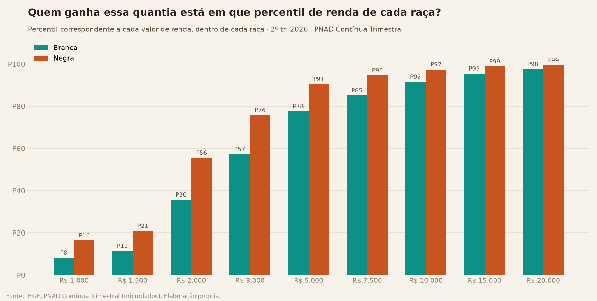

A pergunta INVERSA: quem ganha uma quantia fixa está em que posição da distribuição de CADA
raça? R$3.000 é uma renda "do meio" pra Branca (P57, pouco acima da mediana) — mas a mesma
quantia já coloca uma pessoa negra no P76, perto do topo dos 25% que mais ganham dentro do
próprio grupo. A mesma quantia em R$ representa posições relativas bem diferentes conforme a
raça.

## Raça × Gênero

O hiato de gênero **soma** ao de raça, não substitui.

<strong>Um gráfico por gênero</strong>

## Preta × Parda × Gênero

<strong>Um gráfico por gênero</strong>

## Raça × Faixa etária

O hiato racial se abre justamente na faixa de maior potencial de renda (40-59 anos).

<strong>Um gráfico por faixa etária</strong> (série temporal, 2012-2026)

## Preta × Parda × Faixa etária

<strong>Um gráfico por faixa etária</strong>

## Raça × Escolaridade

**O achado mais importante da Fase 1**: o hiato racial de renda não desaparece quando se
compara pessoas com o mesmo nível de instrução — ele só some ou até se inverte nos níveis
mais baixos, mas **se abre dramaticamente no Superior completo** (Branca R\$8.104 vs. Negra
R\$5.701 vs. Indígena R\$5.725, Brasil, 2026 T2).

<strong>Um gráfico por nível de instrução</strong> (série temporal, 2012-2026)

## Preta × Parda × Escolaridade

<strong>Um gráfico por nível de instrução</strong>

## Raça × Gênero × Escolaridade

O hiato no Superior completo é maior entre homens (Branca R\$10.150 vs. Negra R\$6.955, ~46%)
do que entre mulheres (Branca R\$6.572 vs. Negra R\$4.826, ~36%).

## Raça × Gênero × Faixa etária

Mesmo efeito de abertura em 40-59 anos, visível nos dois gêneros — mais acentuado entre homens.

## Escolaridade × Raça × Gênero

Hiato de conclusão do ensino superior maior que 2× entre Branca (24-29%) e Negra (10-14%).
Mulheres têm taxa de conclusão maior que homens em todos os três grupos raciais.

<strong>Um gráfico por nível de instrução</strong> (os outros 6 níveis — só o Superior
completo estava publicado antes)

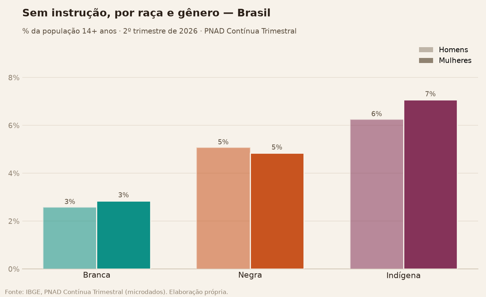
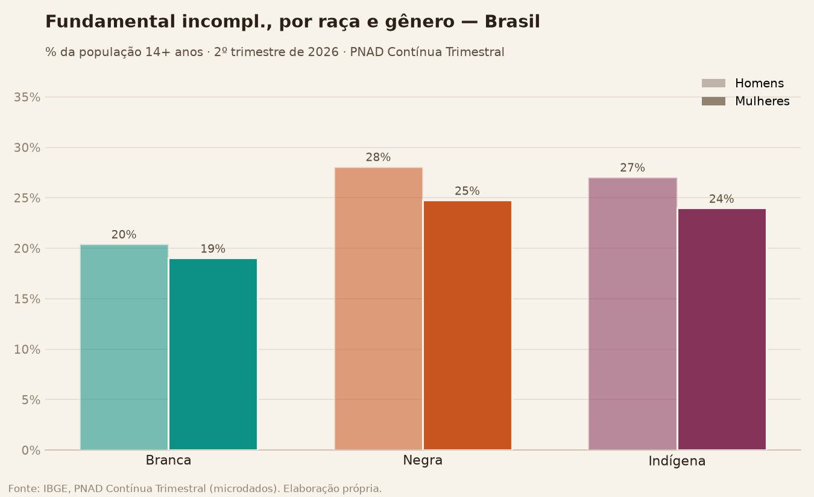
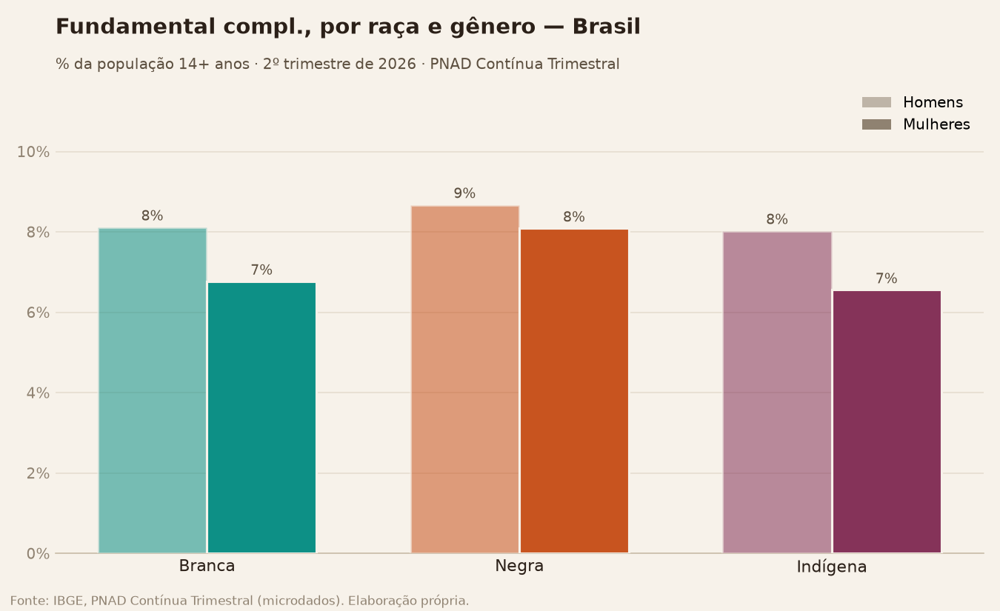
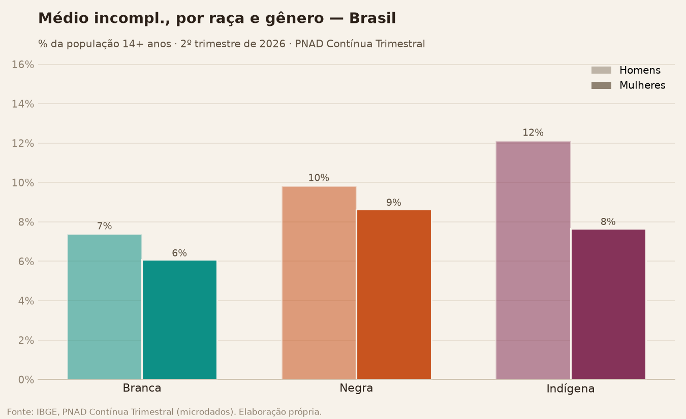
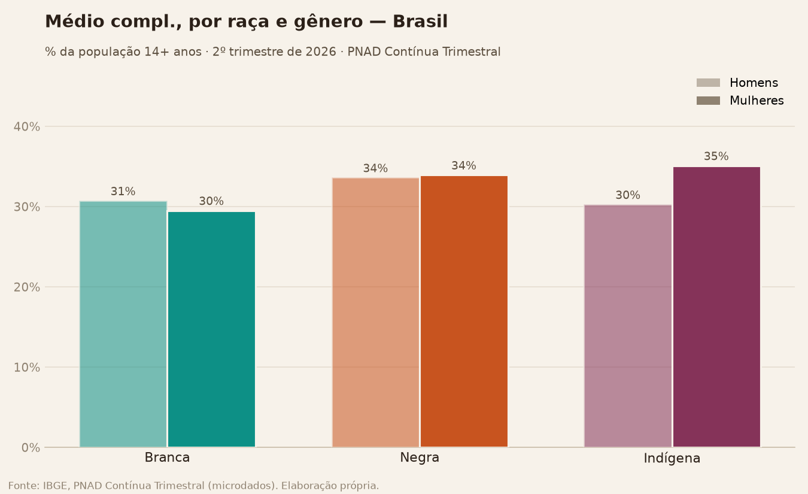
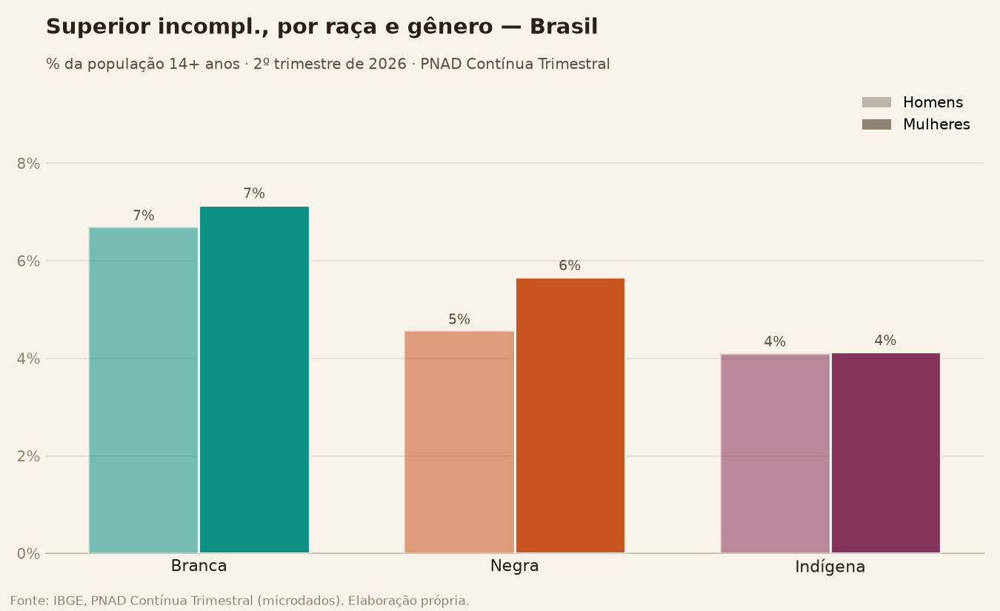

## Raça × Gênero × Faixa etária × Escolaridade

As quatro dimensões de uma vez: um painel por raça × gênero (6 no total), faixa etária nas
colunas, nível de instrução nas linhas, cor = renda real. O padrão "Branca mais escura que
as outras duas em quase toda célula" segura mesmo nesse nível de detalhe.

## Limitações a ter em mente lendo estes gráficos

- Indígena tem amostra pequena — séries temporais de raça isolada usam média móvel de 4
  trimestres; os cortes-instantâneo (escolaridade, faixa etária, heatmap completo) não
  suavizam, então alguns valores podem ser ruidosos nas células mais cruzadas.
- "Negra" nos gráficos = Preta + Parda somadas (ponderado); os gráficos "Preta × Parda"
  mostram as duas populações separadas para quem quiser o detalhe.
- O heatmap completo e os gráficos "por nível de instrução"/"por faixa etária" (recorte
  raça × gênero × escolaridade ou × faixa) combinam Preta+Parda em "Negra" para caber no
  espaço — quem quiser Preta e Parda separadas nesses cruzamentos mais finos precisa gerar a
  partir de `data/processed/renda_completa.parquet` (Brasil apenas).
- "Sem instrução" (nível de instrução) é uma categoria substantiva real do questionário do
  IBGE ("sem instrução e menos de 1 ano de estudo") — **não** é código de não-resposta; quem
  não respondeu/não se aplica já é excluído antes de qualquer gráfico (ver
  [LIMITACOES_E_METODOLOGIA.md](LIMITACOES_E_METODOLOGIA.md)).
- Estes são gráficos **exploratórios** — o hiato Branca-Negra nacional e por região, e a
  decomposição de Oaxaca-Blinder (incl. por quantil), passaram por teste de significância
  formal (Welch e/ou o coeficiente de regressão, respectivamente); as demais comparações
  (por faixa etária, escolaridade, informalidade, alfabetização, desalento etc.) ainda não —
  são comparações de médias ponderadas, não testes estatísticos completos.
- **Bug estatístico real encontrado e corrigido (rodada 2)**: a função
  `erro_padrao_media_ponderada` em `pnadc_core.py` (herdada do projeto anterior) calculava um
  erro padrão inflado por um fator de ~√n em relação ao valor correto — bug puramente de
  código, não de dados; documentado em detalhe no `docs/PLANO.md`.
- **Bug de decodificação real encontrado e corrigido (rodada 3)**: `VD4009` (posição na
  ocupação/carteira assinada) tem 10 categorias e vem zero-padded (`'01'`..`'10'`) no layout
  do IBGE — o código inicial usava `'1'`,`'2'` sem padding, o que fazia `pct_com_carteira`
  sair inteiramente NULO sem erro nenhum. Encontrado só ao conferir a distribuição bruta dos
  valores antes de confiar no número.
- **Frequência escolar (V3014) descartada desta rodada**: a cobertura de V3014 na população
  14-17 anos é de só ~6-8% em vários trimestres testados (2018 a 2026) — bem menor que o
  ~95% de V3001 (alfabetização) ou os ~20% que uma rotação padrão de painel explicaria.
  Não conseguimos confirmar dentro do orçamento desta rodada se essa subamostra é aleatória
  (estimativa válida, só com IC mais largo) ou enviesada — preferimos não publicar um número
  sobre evasão escolar sem entender a regra de coleta exata do IBGE pra essa variável.
- **Geração é uma coorte SINTÉTICA, não um painel real**: "ano de nascimento" é aproximado
  (ano da pesquisa − idade, sem considerar mês de nascimento x mês de entrevista) e cada
  trimestre ainda traz PESSOAS DIFERENTES dentro da mesma geração — só o grupo de nascimento
  se mantém fixo, não os indivíduos. É o método padrão pra estudar coortes em pesquisas
  transversais repetidas (Deaton, 1985), mas não é o mesmo que acompanhar as mesmas pessoas
  ano a ano.
- **"Topo 10%" é aproximado, não exatamente 10%**: renda autodeclarada tem forte concentração
  em valores redondos (R$1.000, R$2.000, R$5.000, R$10.000 etc.) — quando o limiar do P90
  cai bem em cima de um desses valores muito populosos, o corte inclui todo mundo empatado
  ali, capturando um pouco mais que 10% (no trimestre mais recente, ~11,5% de Branca e ~12,8%
  de Negra, checado manualmente). A coluna `pct_populacao_capturada` em
  `perfil_topo10_racial.parquet` registra o valor real capturado a cada trimestre. A mesma
  ressalva vale pros 4 quartis (`perfil_quartis_racial.parquet`) — cada quartil deveria ter
  ~25% da população do grupo, mas heaping nos limiares P25/P50/P75 pode desviar um pouco
  (checado: entre 22% e 31% conforme o quartil e a raça no trimestre mais recente).
