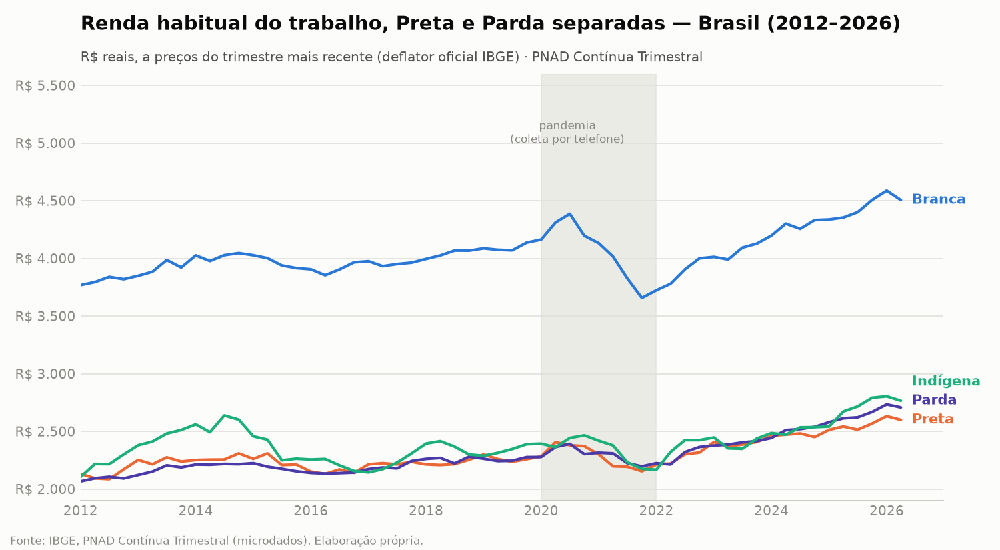

# Análise Fase 1 — PNAD Contínua (2012-2026)

Galeria completa dos gráficos exploratórios da Fase 1, com os achados de cada um. Todos em
R$ reais (deflator oficial do IBGE, ver [PLANO.md](PLANO.md)), Brasil, salvo indicação
contrária. Gerados por `src/processing/graficos_fase1.py` a partir de
`data/processed/{renda,escolaridade,renda_por_escolaridade}.parquet`.

## Renda ao longo do tempo

Hiato grande e persistente entre Branca e Negra/Indígena ao longo de toda a série, com
estreitamento leve entre 2012 e 2026 (razão Branca/Negra caiu de 1,81× para 1,68×).

Preta e Parda **não são a mesma coisa** — mas andam muito próximas ao longo de toda a série,
com Parda ultrapassando levemente Preta nos últimos anos. Isso dá algum respaldo à prática
comum de somá-las em "Negra" para análises agregadas, sem esconder que existe alguma
diferença entre os dois grupos.

O hiato de gênero **soma** ao de raça, não substitui: mulheres brancas ganham menos que
homens brancos, mas ainda mais que homens negros ou indígenas na maior parte da série —
raça e gênero atuam como eixos de desigualdade independentes que se acumulam.

## Escolaridade

Hiato de conclusão do ensino superior maior que 2× entre Branca (24-29%) e Negra (10-14%),
com Indígena um pouco acima de Negra (12-15%). Mulheres têm taxa de conclusão maior que
homens em todos os três grupos raciais — um padrão já bem documentado no Brasil.

## O hiato racial sobrevive ao controle por escolaridade

Este é talvez o achado mais importante da Fase 1: **o hiato racial de renda não desaparece
quando se compara pessoas com o mesmo nível de instrução** — ele só some (Fundamental
completo, Fundamental incompleto) ou até se inverte (Superior incompleto) nos níveis mais
baixos, mas **se abre dramaticamente no Superior completo** (Branca R\$8.104 vs. Negra
R\$5.701 vs. Indígena R\$5.725 — R\$2.400+ de diferença). Isso é consistente com a literatura
sobre desigualdade racial no mercado de trabalho brasileiro: escolaridade explica parte do
hiato de renda, mas não tudo — o resto é composição de ocupações, setor, informalidade e,
plausivelmente, discriminação direta.

O padrão se repete nos dois recortes de gênero, mas a magnitude do hiato no Superior
completo é maior entre homens (Branca R\$10.150 vs. Negra R\$6.955, ~46% de diferença) do que
entre mulheres (Branca R\$6.572 vs. Negra R\$4.826, ~36%) — sugerindo que os eixos de raça e
gênero não são simplesmente aditivos em todos os pontos da distribuição; a interação entre
eles varia por contexto.

## Renda por faixa etária

O hiato racial se abre justamente na faixa de maior potencial de renda (40-59 anos) — sinal
de que não é só "ponto de partida" desigual (14-17, 18-24, onde os hiatos são proporcionalmente
menores), mas também trajetória de carreira desigual ao longo da vida ativa.

## Limitações a ter em mente lendo estes gráficos

- Indígena tem amostra pequena — séries temporais usam média móvel de 4 trimestres; os
  cortes-instantâneo (escolaridade, faixa etária, renda×escolaridade) não suavizam, então
  alguns valores podem ser ruidosos, especialmente cruzados com gênero.
- Os gráficos de "renda por faixa etária" e "renda por raça e escolaridade" excluem a
  amostra de Amarela/Ignorado por foco (não por descarte — ver
  [LIMITACOES_E_METODOLOGIA.md](LIMITACOES_E_METODOLOGIA.md)) e, no caso de faixa etária,
  também excluem Indígena por amostra insuficiente naquele cruzamento específico.
- Estes são gráficos **exploratórios** da Fase 1, não a análise final do projeto — nenhum
  teste de significância estatística foi aplicado às diferenças mostradas aqui (as funções
  para isso já existem em `src/utils/pnadc_core.py::tabela_hiatos_significancia`, mas não
  foram aplicadas nesta rodada).
